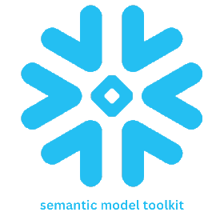

<div align="center">

# Semantic Model Toolkit

<p align="center">
  
  <br>
  <em>Generate Snowflake semantic models programmatically with AI-powered descriptions</em>
</p>

[](https://www.python.org/downloads/)
[](https://pypi.org/project/semantic-model-toolkit/)
[](https://opensource.org/licenses/Apache-2.0)
[](https://www.snowflake.com/)
[](https://openai.com/)
[](https://www.anthropic.com/)

</div>

---

## 📋 Table of Contents

- [Overview](#-overview)
- [Features](#-features)
- [Installation](#-installation)
- [Quick Start](#-quick-start)
- [Usage Examples](#-usage-examples)
  - [Basic Usage](#basic-usage)
  - [Using a Configuration File](#using-a-configuration-file)
  - [Using an Existing Snowflake Connection](#using-an-existing-snowflake-connection)
  - [Using Custom LLM Providers](#using-custom-llm-providers-for-description-generation)
  - [Loading Semantic Models](#loading-a-semantic-model-from-string-or-file)
- [Configuration Reference](#-configuration-reference)
- [Dependencies](#-dependencies)
- [License](#-license)

---

## 🔍 Overview

Semantic Model Toolkit is a Python library that enables you to programmatically generate semantic model YAML strings for Snowflake databases. It eliminates the need for a UI while providing powerful features like AI-powered description generation using various LLM providers.

## ✨ Features

- **No UI Required**: Generate semantic models entirely through code
- **Multiple LLM Integrations**: Support for Snowflake Cortex, OpenAI, Azure OpenAI, and Anthropic Claude
- **Flexible Configuration**: Configure through Python dictionaries or YAML/JSON files
- **Snowflake Integration**: Works with existing Snowflake connections
- **Automatic Descriptions**: AI-powered descriptions for tables and columns
- **Fallback Mechanisms**: Configure fallback LLM providers for reliability

## 📦 Installation

### From PyPI

```bash
pip install semantic-model-toolkit
```

### Optional LLM Dependencies

```bash
# For OpenAI (includes Azure OpenAI)
pip install semantic-model-toolkit[openai]

# For Anthropic
pip install semantic-model-toolkit[anthropic]

# For all LLM providers
pip install semantic-model-toolkit[all]
```

### From Source

```bash
git clone https://github.com/your-username/semantic-model-toolkit.git
cd semantic-model-toolkit
pip install -e .
```

## ⚡ Quick Start

```python
from semantic_model_toolkit import generate_semantic_model

# Create configuration
config = {
    "snowflake": {
        "account": "your-account",
        "user": "your-user",
        "password": "your-password"
    },
    "semantic_model": {
        "name": "sales-model",
        "base_tables": ["SALES_DB.PUBLIC.ORDERS"],
    },
    "llm": {
        "provider": "cortex",
        "model": "llama3-8b"
    }
}

# Generate the semantic model
yaml_str = generate_semantic_model(config)

# Save to file
with open('sales_model.yaml', 'w') as f:
    f.write(yaml_str)
```

## 📖 Usage Examples

### Basic Usage

```python
from semantic_model_toolkit import generate_semantic_model

# Create configuration
config = {
    "snowflake": {
        "account": "your-account",
        "user": "your-user",
        "password": "your-password",
        "role": "your-role",
        "warehouse": "your-warehouse"
    },
    "semantic_model": {
        "name": "your-model-name",
        "base_tables": ["DB.SCHEMA.TABLE1", "DB.SCHEMA.TABLE2"],
        "n_sample_values": 3,
        "allow_joins": False
    },
    "llm": {
        "provider": "cortex",
        "model": "llama3-8b"
    }
}

# Generate the semantic model YAML string
yaml_str = generate_semantic_model(config)

# Save the YAML string to a file (optional)
with open('my_semantic_model.yaml', 'w') as f:
    f.write(yaml_str)
```

### Using a Configuration File

You can also load configuration from a YAML or JSON file:

```python
from semantic_model_toolkit import generate_from_file

# Generate the semantic model from a config file
yaml_str = generate_from_file("path/to/config.yaml")

# Save the YAML string to a file (optional)
with open('my_semantic_model.yaml', 'w') as f:
    f.write(yaml_str)
```

### Using an Existing Snowflake Connection

```python
import snowflake.connector
from semantic_model_toolkit import generate_semantic_model

# Create a Snowflake connection
conn = snowflake.connector.connect(
    user='your_username',
    password='your_password',
    account='your_account',
    warehouse='your_warehouse',
    role='your_role'
)

# Create configuration without Snowflake connection details
config = {
    "semantic_model": {
        "name": "your-model-name",
        "base_tables": ["DB.SCHEMA.TABLE1", "DB.SCHEMA.TABLE2"],
        "n_sample_values": 3,
        "allow_joins": False
    },
    "llm": {
        "provider": "cortex",
        "model": "llama3-8b"
    }
}

# Generate the semantic model using an existing connection
yaml_str = generate_semantic_model(config, snowflake_connection=conn)
```

### Using Custom LLM Providers for Description Generation

The library supports multiple LLM providers for generating descriptions in your semantic models:

<details>
<summary><b>OpenAI</b></summary>

```python
config = {
    "snowflake": {
        "account": "your-account",
        "user": "your-user",
        "password": "your-password"
    },
    "semantic_model": {
        "name": "your-model-name",
        "base_tables": ["DB.SCHEMA.TABLE1"]
    },
    "llm": {
        "provider": "openai",
        "model": "gpt-4", 
        "api_key": "your-openai-api-key",  # Or set OPENAI_API_KEY env var
        "temperature": 0.2,
        "max_tokens": 500
    }
}
```
</details>

<details>
<summary><b>Azure OpenAI</b></summary>

```python
config = {
    "snowflake": {
        "account": "your-account",
        "user": "your-user",
        "password": "your-password"
    },
    "semantic_model": {
        "name": "your-model-name",
        "base_tables": ["DB.SCHEMA.TABLE1"]
    },
    "llm": {
        "provider": "azure_openai",
        "azure_deployment_name": "your-deployment-name",
        "api_key": "your-azure-api-key",  # Or set AZURE_OPENAI_API_KEY env var
        "api_endpoint": "https://your-resource.openai.azure.com/",  # Or set AZURE_OPENAI_ENDPOINT env var
        "api_version": "2023-05-15"
    }
}
```
</details>

<details>
<summary><b>Anthropic Claude</b></summary>

```python
config = {
    "snowflake": {
        "account": "your-account",
        "user": "your-user",
        "password": "your-password"
    },
    "semantic_model": {
        "name": "your-model-name",
        "base_tables": ["DB.SCHEMA.TABLE1"]
    },
    "llm": {
        "provider": "anthropic",
        "model": "claude-3-sonnet-20240229",
        "api_key": "your-anthropic-api-key",  # Or set ANTHROPIC_API_KEY env var
        "temperature": 0.2,
        "max_tokens": 500
    }
}
```
</details>

<details>
<summary><b>Setting up a Fallback LLM</b></summary>

You can configure a fallback LLM provider that will be used if the primary provider fails:

```python
config = {
    # ... snowflake and semantic_model config ...
    "llm": {
        "provider": "cortex",
        "model": "llama3-8b",
        "fallback_provider": "openai",
        "fallback_model": "gpt-3.5-turbo",
        "fallback_api_key": "your-openai-api-key"
    }
}
```
</details>

### Loading a Semantic Model from String or File

```python
from semantic_model_toolkit import load_semantic_model_from_string, load_semantic_model_from_file

# Load from string
semantic_model = load_semantic_model_from_string(yaml_str)

# Load from file
semantic_model = load_semantic_model_from_file("path/to/existing/model.yaml")
```

## 📝 Configuration Reference

<details>
<summary><b>Snowflake Configuration</b></summary>

| Parameter | Description | Required |
|-----------|-------------|----------|
| account | Snowflake account identifier | Yes |
| user | Snowflake username | Yes |
| password | Password for password authentication | No* |
| role | Role to use for the connection | No |
| warehouse | Warehouse to use | No |
| database | Default database | No |
| schema | Default schema | No |
| private_key_path | Path to private key file for key pair authentication | No* |
| private_key_passphrase | Passphrase for the private key | No |
| token | OAuth token for token-based authentication | No* |
| authenticator | Authenticator for SSO auth | No |

*At least one authentication method is required (password, private key, or token)
</details>

<details>
<summary><b>Semantic Model Configuration</b></summary>

| Parameter | Description | Required |
|-----------|-------------|----------|
| name | Name for the semantic model | Yes |
| base_tables | List of fully qualified table names | Yes |
| n_sample_values | Number of sample values to include | No (default: 3) |
| allow_joins | Whether to include placeholder joins | No (default: False) |
</details>

<details>
<summary><b>LLM Configuration</b></summary>

| Parameter | Description | Required |
|-----------|-------------|----------|
| provider | LLM provider to use: "cortex", "openai", "azure_openai", or "anthropic" | No (default: "cortex") |
| model | Model name to use | No (default: "llama3-8b") |
| api_key | API key for the LLM service | No* |
| api_endpoint | Endpoint URL for the LLM service (for Azure) | No* |
| api_version | API version (for Azure) | No |
| azure_deployment_name | Deployment name (for Azure) | No* |
| temperature | Temperature parameter for generation | No (default: 0.2) |
| max_tokens | Maximum tokens to generate | No (default varies by provider) |
| fallback_provider | Fallback LLM provider if primary fails | No |
| fallback_api_key | API key for fallback provider | No |
| fallback_model | Model to use for fallback | No |

*Required for certain providers:
- OpenAI: api_key required (or OPENAI_API_KEY env var)
- Azure OpenAI: api_key, api_endpoint, and azure_deployment_name required (or env vars)
- Anthropic: api_key required (or ANTHROPIC_API_KEY env var)
</details>

## 📄 Sample Configuration

<details>
<summary><b>YAML Configuration</b></summary>

```yaml
snowflake:
  account: myaccount
  user: myuser
  password: mypassword
  role: myrole
  warehouse: mywarehouse

semantic_model:
  name: sales_analytics
  base_tables:
    - SALES_DB.PUBLIC.CUSTOMERS
    - SALES_DB.PUBLIC.ORDERS
    - SALES_DB.PUBLIC.PRODUCTS
  n_sample_values: 3
  allow_joins: true

# Snowflake Cortex LLM (default)
llm:
  provider: cortex
  model: llama3-8b
  
# Example OpenAI configuration (uncomment to use)
# llm:
#   provider: openai
#   model: gpt-4
#   api_key: your_openai_api_key
#   temperature: 0.2
#   max_tokens: 500
```
</details>

## 📚 Dependencies

The core functionality requires:
- Python 3.8+
- snowflake-connector-python
- PyYAML
- loguru
- protobuf

Depending on which LLM provider you want to use, you'll need to install additional packages:

```bash
# For OpenAI (includes Azure OpenAI)
pip install openai

# For Anthropic
pip install anthropic
```

Snowflake Cortex does not require additional packages as it uses your Snowflake connection.

## 🤝 Contributing

Contributions are welcome! Please feel free to submit a Pull Request.

## 📜 License

This project is licensed under the Apache License 2.0 - see the [LICENSE](LICENSE) file for details.
